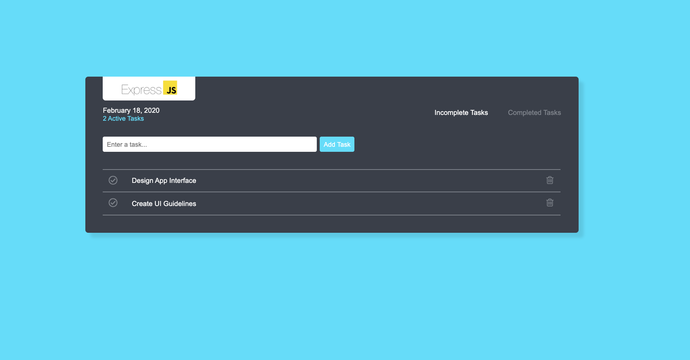

# express-todo

A Simple Todo App Built Using ExpressJS &amp; Edge Templating Engine

## Screenshoot



## Build Setup

This project developed using [Express.js](https://expressjs.com/), for complete documentation please take a look into official documentation in <https://expressjs.com/>.

```bash
# install dependencies
$ npm install

# serve with hot reload at localhost:4000
$ npm run dev
```

## Credit

- Thanks for UI Inspiration [todo-list-app](https://dribbble.com/shots/6570568-Todo-List-App) by [@iantrent](https://dribbble.com/iantrent)

---

Copyright © 2020 by Gunali Rezqi Mauludi
